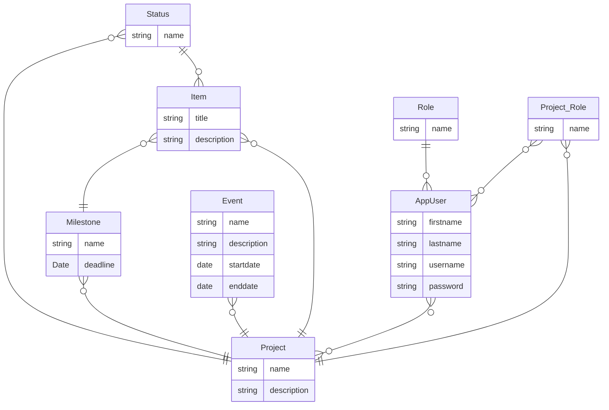

# database schema

## MVP

```mermaid 
erDiagram
    AppUser {
        string firstname
        string lastname
        string username
        string password
    }

    Role {
        string name
    }

    Role ||--o{ AppUser : ""

    Item {
        string title
        string description
    }

    Status {
        string name
    }
    Status ||--o{ Item : ""
    Status }o--|| Project : ""


    Project {
        string name
        string description
    }


    Milestone {
        string name
        Date deadline
    }

    Item }o--|| Milestone : ""
    Milestone }o--|| Project : ""

    Event {
        string name
        string description
        date startdate
        date enddate
    }

    Event }o--|| Project : ""
    Item }o--|| Project : ""
    AppUser }o--o{ Project : ""

    Project_Role {
        string name
    }

    Project_Role }o--|| Project : ""
    Project_Role }o--o{ AppUser : ""

```

## 0.1

```mermaid 
erDiagram
    AppUser {
        string firstname
        string lastname
        string username
        string password
    }

    Role {
        string name
    }

    Role ||--o{ AppUser : ""

    Item {
        string title
        string description
    }

    Status {
        string name
    }
    Status ||--o{ Item : ""
    Status }o--|| Project : ""


    Project {
        string name
        string description
    }


    Milestone {
        string name
        Date deadline
    }

    Item }o--|| Milestone : ""
    Milestone }o--|| Project : ""

    Event {
        string name
        string description
        date startdate
        date enddate
    }

    Event }o--|| Project : ""
    Item }o--|| Project : ""
    AppUser }o--o{ Project : ""

    Project_Role {
        string name
    }

    Project_Role }o--|| Project : ""
    Project_Role }o--o{ AppUser : ""

```